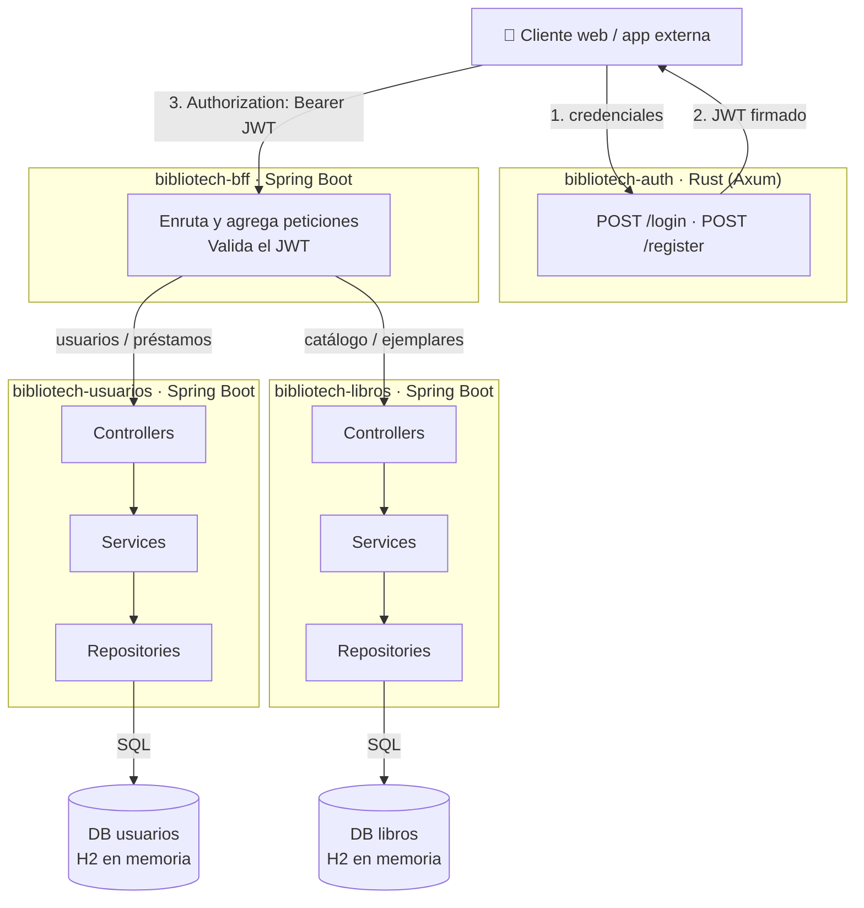
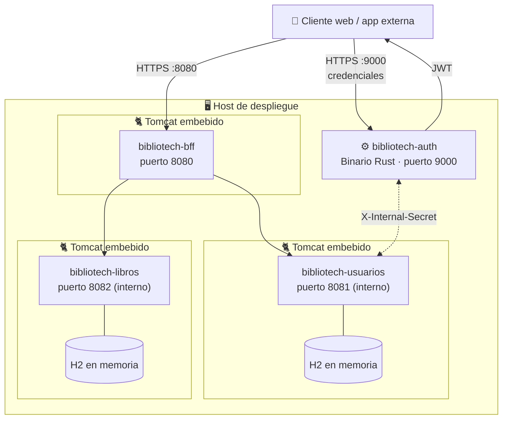
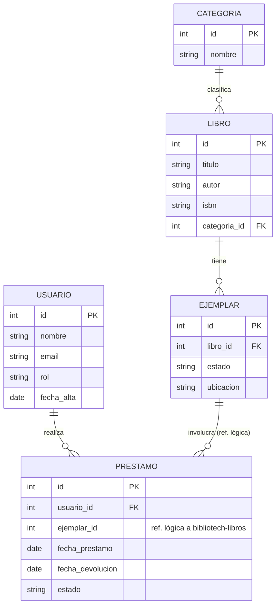

<p align="center">
  
</p>

<p align="center"><i>Práctica de Tecnologías de Servidor — Sistema de gestión de biblioteca</i></p>

<p align="center">
  
  
  
  
  
  
</p>

<p align="center">
  <a href="#arquitectura"></a>
  <a href="#modelo-de-datos"></a>
  <a href="#instalación-y-puesta-en-marcha"></a>
  <a href="#endpoints-de-ejemplo"></a>
  <a href="#documentación-de-la-api-openapi--swagger"></a>
  <a href="#seguridad-y-roles"></a>
  <a href="#pruebas"></a>
</p>

## Equipo TEW1-01

- [Cristian Augusto](https://github.com/augustocristian) - UO237600@uniovi.es
- [Diego](https://github.com/DiegoMfer) - UOXXXX@uniovi.es

## Índice

- [Descripción del proyecto](#descripción-del-proyecto)
- [Estructura del proyecto](#estructura-del-proyecto)
- [Arquitectura](#arquitectura)
- [Modelo de datos](#modelo-de-datos)
- [Requisitos previos](#requisitos-previos)
- [Instalación y puesta en marcha](#instalación-y-puesta-en-marcha)
- [Endpoints de ejemplo](#endpoints-de-ejemplo)
- [Documentación de la API (OpenAPI / Swagger)](#documentación-de-la-api-openapi--swagger)
- [Seguridad y roles](#seguridad-y-roles)
- [Pruebas](#pruebas)
- [Decisiones de implementación](#decisiones-de-implementación)
- [Licencia](#licencia)

## Descripción del proyecto

> ⚠️ Este README es un **ejemplo** de plantilla para la parte de servidor de la práctica. La arquitectura y el
> modelo de datos que se muestran a continuación son **ficticios** (dominio de una biblioteca), pensados solo para
> ilustrar cómo documentar estas secciones. Cada equipo debe sustituirlos por los reales de su propio proyecto.

**BiblioTech API** es un sistema de gestión de biblioteca que permite administrar usuarios, libros, ejemplares y
préstamos. Se implementa como un conjunto de microservicios (autenticación, usuarios y libros) detrás de un único
punto de entrada (BFF), y expone una API REST documentada con OpenAPI.

- **Registro y login** de usuarios, con emisión de JWT.
- **Consulta del catálogo**: listado y búsqueda de libros por categoría, autor o título, con paginación.
- **Gestión de préstamos**: un usuario puede solicitar el préstamo de un ejemplar disponible y devolverlo.
- **Gestión de ejemplares**: el bibliotecario da de alta ejemplares de un libro y actualiza su estado
  (disponible, prestado, en reparación).
- **Gestión de incidencias**: registro y seguimiento de incidencias sobre un ejemplar (deterioro, pérdida...).
- **Administración de usuarios y categorías**: alta, baja y edición, reservada al rol `ADMIN`.
- **Documentación interactiva** de todos los endpoints vía Swagger UI / OpenAPI.

## Estructura del proyecto

> El backend está repartido en varios módulos independientes: dos microservicios de dominio (`usuarios`,
> `libros`), un Backend For Frontend (`bff`) y el servicio de autenticación (`auth`). Ver
> [Decisiones de implementación](#decisiones-de-implementación) para el porqué de este reparto.

```
📁 bibliotech-usuarios/
├── 📦 src/main/java/es/uniovi/bibliotech/usuarios/
│   ├── 📦 controller/
│   ├── 📦 service/
│   ├── 📦 repository/
│   ├── 📦 model/
│   ├── 📦 dto/
│   ├── 📦 config/
│   └── 📦 error/
├── 📦 src/test/java/es/uniovi/bibliotech/usuarios/
│   └── 📦 integration/
└── 📄 pom.xml

📁 bibliotech-libros/            # misma estructura que bibliotech-usuarios
└── 📦 src/main/java/es/uniovi/bibliotech/libros/...

📁 bibliotech-bff/
├── 📦 src/main/java/es/uniovi/bibliotech/bff/
│   ├── 📦 controller/
│   ├── 📦 client/
│   └── 📦 config/
└── 📄 pom.xml

📁 bibliotech-auth/
└── 🦀 src/main.rs
```

- 📦 `controller/` — Controladores REST (capa de presentación)
- 📦 `service/` — Interfaces + `service/impl` con la lógica de negocio (`usuarios` y `libros`)
- 📦 `repository/` — Interfaces Spring Data JPA (`usuarios` y `libros`)
- 📦 `model/` — Entidades JPA (`usuarios` y `libros`)
- 📦 `dto/` — DTOs de entrada/salida por dominio
- 📦 `config/` — Seguridad, configuración de OpenAPI, datos iniciales
- 📦 `error/` — Excepciones de negocio + manejador global (RFC 7807)
- 📦 `client/` — Clientes HTTP del BFF hacia `usuarios` y `libros` (solo en `bibliotech-bff`)
- 📦 `integration/` — Tests de integración (MockMvc / RestTestClient)
- 📄 `pom.xml` — Definición y dependencias Maven (uno por servicio Java)
- 🦀 `main.rs` — Microservicio de autenticación (Rust)

## Arquitectura

Diagrama de arquitectura **de ejemplo**: dos microservicios de dominio (`usuarios`, `libros`, cada uno con su
propia base de datos), un BFF como único punto de entrada para el cliente, y un servicio de autenticación
independiente que emite los JWT.



### Diagrama de despliegue

Diagrama de despliegue **de ejemplo**, sin Docker: cada microservicio Spring Boot se despliega como un `.jar`
autocontenido con su propio contenedor web embebido (Tomcat) y su propia base de datos **H2 en memoria**;
`bibliotech-auth` es un binario Rust independiente. Todos los procesos se ejecutan directamente sobre el mismo
host.



- Cada `.jar` de Spring Boot (`bibliotech-usuarios`, `bibliotech-libros`, `bibliotech-bff`) lleva su propio
  contenedor web embebido (Tomcat): no hace falta instalar un servidor de aplicaciones aparte ni desplegar un
  `.war` en él.
- `bibliotech-auth` no usa contenedor web: es un binario Rust que escucha directamente en su puerto.
- `bibliotech-usuarios` y `bibliotech-libros` usan cada uno su propia base de datos **H2 en memoria**: vive
  dentro del mismo proceso Java, así que no hay que instalar ni desplegar ningún gestor de base de datos aparte.
  Al reiniciar el servicio, sus datos se pierden y se vuelven a sembrar (ver
  [Datos de ejemplo](#instalación-y-puesta-en-marcha)).
- Solo los puertos `8080` (BFF) y `9000` (auth) deberían exponerse fuera del host; `bibliotech-usuarios` y
  `bibliotech-libros` deberían quedar accesibles solo desde el propio host (p. ej. mediante el firewall), ya que
  al no usar contenedores Docker no hay aislamiento de red real entre procesos.

## Modelo de datos

Diagrama entidad-relación **de ejemplo** para el dominio de la biblioteca. Al estar repartido en dos
microservicios, cada entidad vive en la base de datos de su servicio: `USUARIO` y `PRESTAMO` en
`bibliotech_usuarios`; `CATEGORIA`, `LIBRO` y `EJEMPLAR` en `bibliotech_libros`. `PRESTAMO` guarda el
`ejemplar_id` como referencia *lógica* (no hay una FK real entre bases de datos distintas).



## Requisitos previos

| Herramienta | Versión | Necesaria para |
|---|---|---|
| JDK | 21+ | Compilar y ejecutar `bibliotech-usuarios`, `bibliotech-libros` y `bibliotech-bff` |
| Maven | 3.9+ | Construir los servicios Java (`mvn`) |
| Rust (`cargo`) | estable | Compilar y ejecutar `bibliotech-auth` |
| PostgreSQL | 17 | Solo si se ejecuta con el perfil `prod` (en `dev` se usa H2 en memoria) |

### Variables de entorno

> ⚠️ Los valores de ejemplo de esta tabla son **solo para desarrollo local**. En un despliegue real se inyectan
> desde el entorno o un gestor de secretos y nunca se versionan.

| Variable | Servicio(s) | Ejemplo (dev) | Descripción |
|---|---|---|---|
| `SPRING_PROFILES_ACTIVE` | `usuarios`, `libros`, `bff` | `dev` | Perfil activo (`dev` → H2 en memoria, `prod` → PostgreSQL) |
| `DB_URL` | `usuarios` | `jdbc:postgresql://localhost:5432/bibliotech_usuarios` | Cadena de conexión a su base de datos |
| `DB_URL` | `libros` | `jdbc:postgresql://localhost:5433/bibliotech_libros` | Cadena de conexión a su base de datos (puerto distinto: misma máquina) |
| `DB_USER` / `DB_PASSWORD` | `usuarios`, `libros` | `bibliotech` / `bibliotech` | Credenciales de la base de datos |
| `JWT_SECRET` | `bff`, `auth` | `secreto-compartido-de-ejemplo` | Clave HS256 compartida para firmar/validar el JWT |
| `INTERNAL_SECRET` | `usuarios`, `auth` | `secreto-interno-de-ejemplo` | Cabecera `X-Internal-Secret` para las llamadas internas de `auth` a `usuarios` |
| `USUARIOS_URL` | `bff` | `http://localhost:8081` | URL del microservicio de usuarios |
| `LIBROS_URL` | `bff` | `http://localhost:8082` | URL del microservicio de libros |
| `BACKEND_URL` | `auth` | `http://localhost:8081` | URL a la que `auth` reenvía las credenciales a validar |

## Instalación y puesta en marcha

### Desarrollo

```bash
git clone https://github.com/usuario/bibliotech-api.git
cd bibliotech-api

# Microservicios de dominio (perfil "dev", con H2 en memoria)
cd bibliotech-usuarios && mvn spring-boot:run
cd bibliotech-libros   && mvn spring-boot:run

# BFF (en otra terminal)
cd bibliotech-bff && mvn spring-boot:run

# Servicio de autenticación, Rust (en otra terminal)
cd bibliotech-auth && cargo run
```

### Empaquetado y despliegue

```bash
# Spring Boot: generar el .jar ejecutable de cada servicio y arrancarlo
cd bibliotech-usuarios && mvn clean package && java -jar target/bibliotech-usuarios-*.jar
cd bibliotech-libros   && mvn clean package && java -jar target/bibliotech-libros-*.jar
cd bibliotech-bff      && mvn clean package && java -jar target/bibliotech-bff-*.jar

# Rust: compilar en modo release y ejecutar el binario
cd bibliotech-auth && cargo build --release && ./target/release/bibliotech-auth
```

El BFF queda disponible en `http://localhost:8080/bibliotech/api/...` y el servicio de autenticación en
`http://localhost:9000`. `bibliotech-usuarios` y `bibliotech-libros` no se exponen directamente: solo el BFF los
consume (ver [Diagrama de despliegue](#diagrama-de-despliegue)).

### Datos de ejemplo

Cada base de datos se siembra automáticamente al arrancar en desarrollo. Credenciales de prueba (**ficticias**):

| Rol | Email | Contraseña |
|---|---|---|
| Administrador | `admin@bibliotech.es` | `admin123!` |
| Bibliotecario | `biblio1@bibliotech.es` | `biblio123!` |
| Usuario | `user1@example.com` … `user5@example.com` | `user123!` |

### Endpoints de ejemplo

Todos los recursos cuelgan de `/bibliotech/api/` y se acceden **a través del BFF** (puerto `8080`), que enruta
internamente a `bibliotech-usuarios` o `bibliotech-libros`. Los endpoints `/login` y `/register` viven en el
servicio de autenticación (puerto `9000`) y no pasan por el BFF.

| Método | Endpoint                              | Auth requerida | Servicio interno       | Descripción                             |
|--------|-----------------------------------------|:--------------:|--------------------------|-------------------------------------------|
| POST   | `/login`                                | No             | `auth`                   | Autentica al usuario y devuelve un JWT     |
| GET    | `/bibliotech/api/libros`                | No             | `libros`                 | Lista los libros, con paginación (`?page=&size=&sort=`) |
| POST   | `/bibliotech/api/prestamos`             | Sí (`USUARIO`) | `usuarios` + `libros`    | Registra un préstamo (reserva ejemplar en `libros`, lo anota en `usuarios`) |

El resto de endpoints (registro, gestión de ejemplares e incidencias, administración de usuarios y categorías...)
siguen la misma convención y están documentados en el propio [Swagger UI](#documentación-de-la-api-openapi--swagger),
no aquí.

Las peticiones autenticadas se envían con la cabecera `Authorization: Bearer <token>`, donde `<token>` es el JWT
devuelto por `/login`; el BFF lo valida una vez y lo reenvía a los microservicios internos.

## Documentación de la API (OpenAPI / Swagger)

El BFF documenta automáticamente la API pública a partir de las anotaciones de sus controladores gracias a
[`springdoc-openapi`](https://springdoc.org/), sin necesidad de mantener el contrato a mano:

- **Swagger UI** (interfaz interactiva para probar los endpoints): `http://localhost:8080/swagger-ui.html`
- **Especificación OpenAPI en JSON** (para importar en Postman/Insomnia u otras herramientas):
  `http://localhost:8080/v3/api-docs`

Ambas rutas son públicas y viven en el BFF. `bibliotech-usuarios` y `bibliotech-libros` exponen también su propio
`springdoc-openapi` internamente, útil en desarrollo, pero no se publica al no estar accesibles fuera de la red
interna. Desde Swagger UI se puede pulsar en **Authorize** e introducir el JWT obtenido en `/login` (esquema
`bearer-jwt`) para probar directamente los endpoints protegidos.

## Seguridad y roles

La autenticación se basa en JWT (HS256), firmado por `bibliotech-auth` y validado por `bibliotech-bff` como
recurso OAuth2; el BFF reenvía el JWT (o la identidad ya resuelta) a los microservicios internos en cada llamada.

**Claims del JWT (ejemplo):**

| Claim | Contenido |
|---|---|
| `sub` | Email del usuario |
| `uid` | Id numérico del usuario |
| `roles` | Uno de `USUARIO`, `BIBLIOTECARIO`, `ADMIN` |
| `exp` | Expiración (1 hora) |

**Roles y permisos (ejemplo):**

| Rol | Puede... |
|---|---|
| `USUARIO` | Consultar el catálogo, pedir y devolver préstamos propios |
| `BIBLIOTECARIO` | Gestionar ejemplares, marcar préstamos como devueltos, ver incidencias |
| `ADMIN` | Todo lo anterior + gestionar usuarios y categorías |

## Pruebas

```bash
cd bibliotech-usuarios && mvn verify   # unitarias + integración + cobertura (JaCoCo)
cd ../bibliotech-libros && mvn verify
cd ../bibliotech-bff && mvn verify
```

El informe de cobertura de cada servicio se genera en `<módulo>/target/site/jacoco/index.html`. Las pruebas de
integración (`src/test/java/.../integration`) levantan el contexto de Spring de cada microservicio con una base
H2 en memoria y firman sus propios JWT de prueba con el mismo secreto de desarrollo, sin depender de
`bibliotech-auth` ni del resto de servicios.

## Decisiones de implementación

> Esta sección es el lugar para documentar decisiones de diseño relevantes: el problema, las alternativas
> valoradas y el porqué de la elegida. A continuación, dos decisiones **de ejemplo** que justifican la
> arquitectura mostrada más arriba.

### 1. División en dos microservicios: `usuarios` y `libros`

El servicio de biblioteca se divide en dos microservicios independientes según su dominio:

- **`bibliotech-usuarios`**: gestiona usuarios, perfiles y préstamos.
- **`bibliotech-libros`**: gestiona el catálogo, libros, ejemplares y categorías.

Cada uno con su propia base de datos y ciclo de despliegue (ver [Modelo de datos](#modelo-de-datos)). Se eligió
esta separación porque son dos dominios de negocio con tasas de cambio y de carga muy distintas (el catálogo
cambia poco y se lee mucho; los préstamos se escriben constantemente), lo que permite escalarlos y desplegarlos
de forma independiente. Como contrapartida, una operación que toca ambos dominios (p. ej. registrar un préstamo,
que valida el usuario y reserva un ejemplar) deja de ser una transacción local y pasa a requerir comunicación
entre servicios.

### 2. Incorporación de un Backend For Frontend (BFF)

Con la autenticación (`bibliotech-auth`) y dos microservicios de dominio, el cliente tendría que conocer y
orquestar llamadas contra tres servicios distintos. Para evitarlo, se introduce un **BFF** (`bibliotech-bff`,
ver diagrama en [Arquitectura](#arquitectura)) entre el cliente y los microservicios:

- Es el único punto de entrada de la aplicación cliente para los recursos de negocio: agrega en una sola
  respuesta datos que viven en `usuarios` y en `libros` (por ejemplo, el detalle de un préstamo, que necesita el
  nombre del usuario y el título del libro).
- Valida el JWT una única vez y lo reenvía a los microservicios internos, que ya no necesitan exponerse
  directamente al cliente (ver [Diagrama de despliegue](#diagrama-de-despliegue)).
- Encapsula la topología interna: los microservicios de dominio pueden dividirse, fusionarse o reubicarse sin que
  el cliente se entere.

### 3. Convenciones de la API y manejo de errores

- Todos los recursos de negocio cuelgan de `/bibliotech/api/` y pasan por el BFF; los endpoints `/login` y
  `/register` son la única excepción deliberada (viven en `bibliotech-auth`).
- Los errores siguen **RFC 7807** (`ProblemDetail`, con `type`, `title`, `status`, `detail`, `instance`) en
  `usuarios` y `libros`; el BFF los propaga tal cual al cliente en vez de generar cuerpos de error propios.

| Situación | Código HTTP |
|---|---|
| Recurso inexistente | `404 Not Found` |
| Conflicto (duplicado, estado inválido) | `409 Conflict` |
| Regla de negocio incumplida (p. ej. sin ejemplares disponibles) | `422 Unprocessable Entity` |
| Credenciales inválidas | `401 Unauthorized` |
| Rol insuficiente o recurso ajeno | `403 Forbidden` |
| Colecciones grandes (`GET /bibliotech/api/libros`) | Paginadas con `?page=&size=&sort=` |

## Licencia

Este proyecto de ejemplo se distribuye bajo licencia [MIT](https://opensource.org/licenses/MIT).

---

<p align="center">
  
  &nbsp;Tecnologías Web - Grado en Ingeniería Informática de Tecnologías de la Información
</p>
