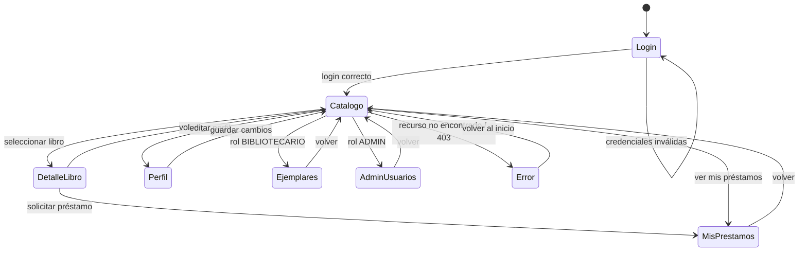
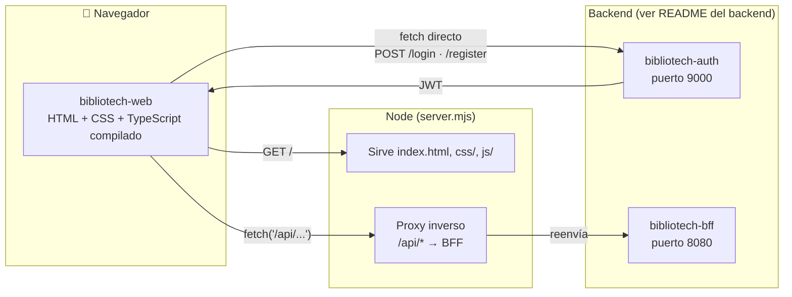

<p align="center">
  
</p>

<p align="center"><i>Práctica de Tecnologías de Cliente — Sistema de gestión de biblioteca</i></p>

<p align="center">
  <br/>
  
  
  
  
  
</p>

<p align="center">
  <br/>
  
  
  
  
  
  
  
</p>

<p align="center">
  
</p>

<p align="center">
  <a href="#mapa-de-navegación"></a>
  <a href="#arquitectura"></a>
  <a href="#instalación-y-puesta-en-marcha"></a>
  <a href="#pruebas"></a>
  <a href="#integración-continua"></a>
</p>

## Equipo TEW1-01

- [Cristian Augusto](https://github.com/augustocristian) - UO237600@uniovi.es
- [Diego](https://github.com/DiegoMfer) - UOXXXX@uniovi.es

## Índice

- [Descripción del proyecto](#descripción-del-proyecto)
- [Estructura del proyecto](#estructura-del-proyecto)
- [Mapa de navegación](#mapa-de-navegación)
- [Arquitectura](#arquitectura)
- [Requisitos previos](#requisitos-previos)
- [Instalación y puesta en marcha](#instalación-y-puesta-en-marcha)
- [Pruebas](#pruebas)
- [Integración continua](#integración-continua)
- [Decisiones de implementación](#decisiones-de-implementación)
- [Licencia](#licencia)

## Descripción del proyecto

> ⚠️ Este README es un **ejemplo** de plantilla para la parte de cliente de la práctica. El mapa de navegación y
> las decisiones que se muestran a continuación son **ficticios**, pensados solo para ilustrar cómo documentar
> estas secciones. Cada equipo debe sustituirlos por los reales de su propio proyecto.

**BiblioTech Web** es la aplicación cliente de BiblioTech: una SPA construida con **HTML5, CSS3 y TypeScript
puro** (sin frameworks de UI) que consume la API REST expuesta por el [backend](README-backend.md) (a través de
su BFF) para que usuarios, bibliotecarios y administradores gestionen el catálogo, los préstamos y los usuarios
desde el navegador.

- **Login y registro**, con la sesión (JWT) guardada en el cliente.
- **Consulta del catálogo**, con búsqueda, filtros por categoría y paginación.
- **Gestión de préstamos**: solicitar un préstamo y consultar el historial propio.
- **Panel de bibliotecario**: gestión de ejemplares e incidencias.
- **Panel de administración**: gestión de usuarios y categorías, reservado al rol `ADMIN`.
- **Selector de idioma** (es/en), con los textos cargados en tiempo de ejecución.
- **Modo sin conexión**: la aplicación instalable (PWA) sigue mostrando el catálogo ya visitado sin red.
- **Vistas adaptadas por rol**: cada perfil (`USUARIO`, `BIBLIOTECARIO`, `ADMIN`) ve solo las pantallas que le
  corresponden.

## Estructura del proyecto

> Las pruebas de sistema **no** viven dentro de este proyecto: son un directorio Java/Maven aparte,
> [`bibliotech-webtest/`](#pruebas), hermano de `bibliotech-web/` (y del resto de servicios del backend).

```
📁 bibliotech-web/
├── 📁 src/                  # TypeScript, compilado con tsc (sin bundler)
│   ├── 📁 api/
│   ├── 📁 vistas/
│   ├── 📁 componentes/
│   ├── 📁 router/
│   └── 📁 i18n/
├── 📁 css/
├── 📄 index.html
├── 📄 manifest.json
├── 📄 sw.js
├── 📄 server.mjs
├── 📄 tsconfig.json
└── 📄 package.json

📁 bibliotech-webtest/        # Directorio Java/Maven clásico, aparte, con las pruebas de sistema
├── 📁 src/test/java/es/uniovi/bibliotech/webtest/
└── 📄 pom.xml
```

- 📁 `api/` — Funciones `fetch` tipadas hacia el BFF (`bibliotech-bff`) y hacia `bibliotech-auth`
- 📁 `vistas/` — Una función de render por pantalla (Catálogo, Detalle de libro, Mis préstamos, Perfil, Admin...)
- 📁 `componentes/` — Snippets reutilizables clonados a partir de `<template>` (tarjetas, filas, modales)
- 📁 `router/` — Navegación por `hash` (`#/catalogo`, `#/mis-prestamos`...) sin librerías externas
- 📁 `i18n/` — Recursos de traducción (`es.json`, `en.json`) cargados con `fetch`
- 📄 `index.html` — Única página HTML de la SPA (plantilla base: cabecera, navegación, zona de contenido)
- 📄 `manifest.json` — Ficha de la PWA (nombre, iconos, cómo se abre)
- 📄 `sw.js` — *Service worker*: cachea el *shell* y los recursos de i18n, deja pasar las escrituras a la API
- 📄 `server.mjs` — Servidor Node que sirve los estáticos y hace de *proxy* inverso de `/api/*` hacia el backend
- 📄 `tsconfig.json` — Configuración del compilador TypeScript (`tsc`)
- 📄 `bibliotech-webtest/` — Proyecto Maven independiente (JUnit + Selenium WebDriver) con las pruebas de sistema

## Mapa de navegación

Diagrama de navegación **de ejemplo** entre las pantallas de la aplicación:



Cada estado es una vista renderizada dentro del mismo `index.html` (no hay recarga de página); el
`router/` interno cambia de vista al detectar un cambio en `location.hash` y actualiza la zona de contenido de la
plantilla base con el snippet correspondiente.

## Arquitectura

Diagrama de arquitectura **de ejemplo**: la SPA se compila a JavaScript estático y la sirve un pequeño servidor
Node, que además actúa de *proxy* inverso hacia el BFF del [backend](README-backend.md) para evitar problemas de
CORS; el login se resuelve aparte, directamente contra el servicio de autenticación.



## Requisitos previos

> 🔗 Estos requisitos **complementan** a los del backend, no los sustituyen: consulta también los
> [Requisitos previos del backend](README-backend.md#requisitos-previos). Para esta entrega, el
> [README del backend](README-backend.md) debería **ampliarse** con las secciones oportunas (Docker Compose,
> perfil `prod` con PostgreSQL...); aquí solo se destacan, a modo de referencia, las partes que afectan
> directamente al cliente.

| Herramienta | Versión | Necesaria para |
|---|---|---|
| Node.js | 20+ | Compilar TypeScript (`tsc`) y ejecutar `server.mjs` |
| JDK + Maven | 21+ / 3.9+ | Ejecutar las pruebas de sistema (`bibliotech-webtest/`, Selenium WebDriver) |
| Navegador + *driver* de Selenium | — | Ejecutar las pruebas E2E (p. ej. ChromeDriver) |
| Backend de BiblioTech | — | La SPA necesita el BFF y el servicio de autenticación arrancados: en local, perfil `dev` (H2); en CI, con Docker Compose y perfil `prod` (PostgreSQL) — ver [README del backend](README-backend.md) |

### Variables de entorno

| Variable | Usada por | Ejemplo (dev) | Descripción |
|---|---|---|---|
| `PORT` | `server.mjs` | `3000` | Puerto en el que Node sirve la SPA |
| `API_PROXY_TARGET` | `server.mjs` | `http://localhost:8080` | URL del BFF al que se reenvía `/api/*` |
| `AUTH_URL` | Cliente (`config.json` servido por Node) | `http://localhost:9000` | URL del servicio de autenticación para el login |

## Instalación y puesta en marcha

> 🔗 Estos pasos **se integran** con los del backend: arranca primero el backend siguiendo su
> [Instalación y puesta en marcha](README-backend.md#instalación-y-puesta-en-marcha) y, después, la SPA con lo
> siguiente. De nuevo, el README del backend es quien debe documentar en detalle su propia puesta en marcha
> (incluida la variante con Docker Compose de esta entrega); aquí no se repite, solo se enlaza.

```bash
git clone https://github.com/usuario/bibliotech-web.git
cd bibliotech-web

npm install
npx tsc              # compila src/**/*.ts a js/**/*.js (sin bundler)
node server.mjs       # sirve los estaticos y expone el proxy /api/*
```

La aplicación queda disponible en `http://localhost:3000`. Necesita el backend (BFF + auth) arrancado en paralelo
(ver [Instalación del backend](README-backend.md#instalación-y-puesta-en-marcha)).

## Pruebas

Las pruebas de sistema viven en `bibliotech-webtest/`: un proyecto Java/Maven clásico y **aparte** (hermano de
`bibliotech-web/`, no un subdirectorio suyo), escrito con **JUnit + Selenium WebDriver** (sin Cucumber ni BDD).

```bash
cd bibliotech-webtest
mvn verify -Pe2e
```

Cada historia de usuario del [mapa de navegación](#mapa-de-navegación) tiene su propia clase `*SystemTest.java`
en `es.uniovi.bibliotech.webtest`, que abre un navegador real (o *headless*) con Selenium WebDriver y comprueba
el flujo completo contra la aplicación ya arrancada (cliente + backend). Al igual que en el backend, las pruebas
están desactivadas por defecto (`skipTests`) y solo se ejecutan con el perfil Maven `e2e`, porque necesitan todo
el stack levantado.

## Integración continua

El workflow de GitHub Actions (`.github/workflows/ci.yml`) se ejecuta en cada *push*/PR a `main` y:

1. Instala dependencias y ejecuta `npx tsc --noEmit` para comprobar que el proyecto tipa correctamente.
2. Levanta el backend con **Docker Compose** (perfil `prod`, con **PostgreSQL** en vez del H2 en memoria que se
   usa en local) y la SPA, y ejecuta `mvn verify -Pe2e` en `bibliotech-webtest/` contra un navegador *headless*.
3. Publica el informe de Surefire como *artifact* de la ejecución.

## Decisiones de implementación

> A continuación, algunas decisiones de diseño **de ejemplo** relacionadas específicamente con la interfaz y la
> experiencia de usuario.

### 1. TypeScript puro en vez de un framework de UI

El proyecto es pequeño y con fines didácticos: se descartó React/Vue/Angular y se optó por **TypeScript sin
framework**, usando el elemento nativo `<template>` para clonar los fragmentos de HTML reutilizables
(tarjetas de libro, filas de la tabla de préstamos...). Se evita así la curva de aprendizaje y el paso de
compilación adicional (JSX, *bundler*) que un framework moderno introduciría, a cambio de escribir a mano la
sincronización entre el estado y el DOM que un framework daría gratis.

### 2. Bootstrap 5 por CDN en vez de un preprocesador propio

Los estilos se resuelven con Bootstrap 5 cargado por CDN (con el atributo `integrity` para verificar que el
fichero no ha sido alterado), en vez de escribir CSS a mano o compilar Sass. Como no hay paso de *build* para el
CSS, cualquier cambio de maquetado se ve recargando la página, lo que encaja con el resto del proyecto (sin
*bundler*).

### 3. Internacionalización hecha a mano en vez de una librería

Con solo dos idiomas (es/en) y un número moderado de textos, no se justifica añadir una librería como
`i18next`: los textos viven en ficheros JSON (`i18n/es.json`, `i18n/en.json`), se cargan con `fetch` al arrancar
o al cambiar de idioma, y se guardan en `localStorage` para recordarlo entre visitas. El formateo de fechas y
números usa la API estándar `Intl`, sin código propio.

### 4. *Service worker* manual en vez de un plugin de terceros

La aplicación es instalable (PWA) gracias a un `manifest.json` y un `sw.js` escritos a mano, en vez de generarlos
con un plugin. Se cachea en `cache-first` el *shell* de la aplicación (`index.html`, CSS, JS) y los recursos de
i18n (cambian poco), pero las peticiones de escritura (p. ej. `POST /api/prestamos`) van **siempre a red**: cachear
una escritura serviría una respuesta desactualizada o duplicaría la operación al reintentarla desde caché.

### 5. Node como *proxy* inverso en vez de configurar CORS en el backend

En lugar de que cada microservicio del backend tenga que permitir CORS para el origen del cliente, el propio
Node que sirve los estáticos reenvía `/api/*` al BFF (ver [Arquitectura](#arquitectura)): para el navegador, el
backend está en el mismo origen que la SPA. Esto mantiene la configuración de CORS fuera del backend, a costa de
un salto de red adicional dentro de la misma máquina.

## Licencia

Este proyecto de ejemplo se distribuye bajo licencia [MIT](https://opensource.org/licenses/MIT).

---

<p align="center">
  
  &nbsp;Tecnologías Web - Grado en Ingeniería Informática de Tecnologías de la Información
</p>
